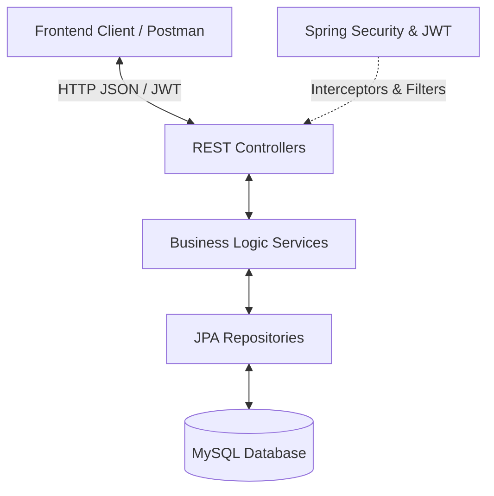

# 📘 Gestion des Rattrapages - Backend Integration Guide

Welcome to the backend reference guide for the **Gestion des Rattrapages** application. This document details the backend's architecture, data models, APIs, and key integration points to facilitate seamless frontend development and integration.

---

## 🏗️ Architecture Overview

The backend is built as a **REST API** using **Java 17** and **Spring Boot 3.2.5**. It follows a standard layered architecture with a clear separation of concerns:



### Key Technical Specs
* **Core Framework**: Spring Boot `3.2.5`
* **Language**: Java `17`
* **Data Access**: Spring Data JPA & Hibernate
* **Database**: MySQL (with automatic schema update via `spring.jpa.hibernate.ddl-auto=update`)
* **Security**: Spring Security configured for stateless JWT authentication
* **Utility Libraries**: Lombok, Jakarta Validation

---

## ⚙️ Configuration & Environment

The backend configuration is managed in [application.properties](file:///c:/Users/pc/Desktop/S6/JEE/projectjee/src/main/resources/application.properties):

* **Server Port**: `8082` (Runs at `http://localhost:8082`)
* **Database**: `gestion_rattrapage`
  * URL: `jdbc:mysql://localhost:3306/gestion_rattrapage?createDatabaseIfNotExist=true&serverTimezone=UTC`
  * Username: `root`
  * Password: *(empty)*
* **JWT Security Constants**:
  * Secret Key: `votreSuperCleSecreteDePlusDe64CaracteresPourLaSecuriteDuProjetJEE2024`
  * Expiration: `86400000` ms (24 hours)

> [!NOTE]
> On startup, the [DatabaseSeeder](file:///c:/Users/pc/Desktop/S6/JEE/projectjee/src/main/java/com/unif/gestionrattrapage/config/DatabaseSeeder.java) automatically populates the `roles` table with the default roles (`ROLE_ENSEIGNANT` and `ROLE_ADMIN`) if they do not exist.

---

## 🗄️ Domain Models & Database Schema

The domain layer is represented by the following entities in `com.unif.gestionrattrapage.models`:

### 1. User
Represents users (teachers or admins) within the system.
* **Fields**:
  * `id` (`Long`): Primary Key, auto-incremented.
  * `username` (`String`): Unique, max 20 chars.
  * `email` (`String`): Unique, email format, max 50 chars.
  * `password` (`String`): BCrypt encrypted, max 120 chars.
  * `roles` (`Set<Role>`): Many-to-many relationship with `Role`.

### 2. Role & ERole
Defines the authorization scopes.
* **Roles**:
  * `ROLE_ENSEIGNANT`: Default role for teachers.
  * `ROLE_ADMIN`: Administrative role with privileges to manage rooms.

### 3. Salle (Classroom)
Represents a classroom that can be reserved for catching up exams.
* **Fields**:
  * `id` (`Long`): Primary Key, auto-incremented.
  * `nom` (`String`): Unique room identifier (e.g., "Salle A101").
  * `capacite` (`int`): Maximum seat capacity.
  * `localisation` (`String`): Room location details (e.g., "Bloc A, 1er étage").

### 4. Seance (Session Details)
Contains the details of the class session that needs a catch-up exam.
* **Fields**:
  * `id` (`Long`): Primary Key, auto-incremented.
  * `matiere` (`String`): Course subject (e.g., "Java EE").
  * `groupe` (`String`): Target student group (e.g., "Classe 3A").

### 5. Reservation
Coordinates a teacher, room, and session details at a specific date and time.
* **Fields**:
  * `id` (`Long`): Primary Key, auto-incremented.
  * `date` (`LocalDate`): Date of the catch-up session (`YYYY-MM-DD`).
  * `heureDebut` (`LocalTime`): Start time (`HH:MM:SS`).
  * `heureFin` (`LocalTime`): End time (`HH:MM:SS`).
  * `enseignant` (`User`): Many-to-one relationship representing the reserving teacher.
  * `salle` (`Salle`): Many-to-one relationship representing the reserved classroom.
  * `seance` (`Seance`): Many-to-one relationship with cascade-all representing session details.
  * `status` (`EStatus`): Enum status, defaults to `PENDING`. Other values: `APPROVED`, `REJECTED`.

---

## 🔒 Security & CORS

1. **Stateeless JWT Authentication**: Except for public endpoints under `/api/auth/**` and `/api/test/**`, all routes require a valid JSON Web Token.
2. **CORS Configuration**: `@CrossOrigin(origins = "*")` is declared on all REST controllers. This ensures the frontend (running on React/Vite/Vue local ports like `http://localhost:5173`) can easily call the backend without cross-origin blocks.
3. **Authorization Header**: Requests must carry the header:
   ```http
   Authorization: Bearer <your_jwt_token_here>
   ```

---

## 🔌 API Endpoint Reference

### Auth Endpoints (Public)

#### 1. User Registration
* **URL**: `/api/auth/signup`
* **Method**: `POST`
* **Request Body**:
  ```json
  {
    "username": "prof1",
    "email": "prof1@unif.com",
    "password": "password123",
    "role": ["enseignant"]
  }
  ```
* **Success Response (200 OK)**:
  ```json
  {
    "message": "Utilisateur enregistré avec succès !"
  }
  ```
* **Error Response (400 Bad Request)**:
  ```json
  {
    "message": "Erreur: Le nom d'utilisateur est déjà pris !"
  }
  ```

#### 2. User Sign-in
* **URL**: `/api/auth/signin`
* **Method**: `POST`
* **Request Body**:
  ```json
  {
    "username": "prof1",
    "password": "password123"
  }
  ```
* **Success Response (200 OK)**:
  ```json
  {
    "token": "eyJhbGciOiJIUzI1NiJ9...",
    "type": "Bearer",
    "id": 1,
    "username": "prof1",
    "email": "prof1@unif.com",
    "roles": ["ROLE_ENSEIGNANT"]
  }
  ```

---

### Salles (Classrooms) Endpoints (Authenticated)

#### 1. Get All Salles
* **URL**: `/api/salles`
* **Method**: `GET`
* **Headers**: `Authorization: Bearer <JWT>`
* **Response**:
  ```json
  [
    {
      "id": 1,
      "nom": "Salle A101",
      "capacite": 40,
      "localisation": "Bloc A, 1er étage"
    }
  ]
  ```

#### 2. Get Salle by ID
* **URL**: `/api/salles/{id}`
* **Method**: `GET`
* **Headers**: `Authorization: Bearer <JWT>`
* **Response (200 OK)**:
  ```json
  {
    "id": 1,
    "nom": "Salle A101",
    "capacite": 40,
    "localisation": "Bloc A, 1er étage"
  }
  ```

#### 3. Create a Salle (Admin)
* **URL**: `/api/salles`
* **Method**: `POST`
* **Headers**: `Authorization: Bearer <JWT>`
* **Request Body**:
  ```json
  {
    "nom": "Salle B202",
    "capacite": 35,
    "localisation": "Bloc B, 2ème étage"
  }
  ```
* **Response**: Returns the created `Salle` entity with generated ID.

#### 4. Delete a Salle (Admin)
* **URL**: `/api/salles/{id}`
* **Method**: `DELETE`
* **Headers**: `Authorization: Bearer <JWT>`
* **Response**: `200 OK`

---

### Reservations Endpoints (Authenticated)

#### 1. Get All Reservations
* **URL**: `/api/reservations`
* **Method**: `GET`
* **Headers**: `Authorization: Bearer <JWT>`
* **Response**: List of all reservation objects.

#### 2. Get Reservations by Teacher ID
* **URL**: `/api/reservations/enseignant/{teacherId}`
* **Method**: `GET`
* **Headers**: `Authorization: Bearer <JWT>`
* **Response**: List of reservation objects created by the specified teacher.

#### 3. Create a Reservation
* **URL**: `/api/reservations`
* **Method**: `POST`
* **Headers**: `Authorization: Bearer <JWT>`
* **Request Body**:
  ```json
  {
    "date": "2026-05-24",
    "heureDebut": "10:00:00",
    "heureFin": "12:00:00",
    "enseignant": {
      "id": 1
    },
    "salle": {
      "id": 1
    },
    "seance": {
      "matiere": "Java EE",
      "groupe": "Classe 3A"
    }
  }
  ```
* **Success Response (200 OK)**:
  ```json
  {
    "id": 1,
    "date": "2026-05-24",
    "heureDebut": "10:00:00",
    "heureFin": "12:00:00",
    "enseignant": {
      "id": 1,
      "username": "prof1",
      "email": "prof1@unif.com",
      "roles": [...]
    },
    "salle": {
      "id": 1,
      "nom": "Salle A101",
      "capacite": 40,
      "localisation": "Bloc A, 1er étage"
    },
    "seance": {
      "id": 1,
      "matiere": "Java EE",
      "groupe": "Classe 3A"
    },
    "status": "PENDING"
  }
  ```
* **Conflict Response (400 Bad Request)**:
  If the classroom is already occupied during the requested slot, the backend throws a conflict exception:
  ```text
  Conflit détecté : La salle est déjà occupée sur ce créneau !
  ```

#### 4. Delete a Reservation
* **URL**: `/api/reservations/{id}`
* **Method**: `DELETE`
* **Headers**: `Authorization: Bearer <JWT>`
* **Response**: `200 OK`

---

## ⚡ Key Business Logic: Conflict Checking

Double bookings are strictly prevented at the database level using a custom query on `ReservationRepository`:

```java
@Query("SELECT COUNT(r) > 0 FROM Reservation r WHERE r.salle.id = :salleId " +
       "AND r.date = :date " +
       "AND r.heureDebut < :heureFin " +
       "AND r.heureFin > :heureDebut")
boolean existsConflict(@Param("salleId") Long salleId, 
                       @Param("date") LocalDate date, 
                       @Param("heureDebut") LocalTime heureDebut, 
                       @Param("heureFin") LocalTime heureFin);
```

### How the Overlap Formula Works
Two time slots `[S1, E1]` and `[S2, E2]` overlap if and only if:
$$\text{Start}_1 < \text{End}_2 \quad \text{and} \quad \text{End}_1 > \text{Start}_2$$
If the query returns `true`, the reservation is rejected, preventing any scheduler conflict.

---

## 💻 Frontend Integration Guide

Here is a quick checklist/example for the frontend developer to handle authentication and API calls using Axios or Fetch:

### 1. Storing Auth State (LocalStorage / SessionStorage / State Manager)
Upon a successful sign-in (`POST /api/auth/signin`), store the `token`, user `id`, and user `roles` locally:

```javascript
// Example in React/JS
const handleLogin = async (username, password) => {
  try {
    const response = await axios.post('http://localhost:8082/api/auth/signin', { username, password });
    const { token, id, roles } = response.data;
    
    localStorage.setItem('token', token);
    localStorage.setItem('userId', id);
    localStorage.setItem('userRoles', JSON.stringify(roles));
    
    // Redirect user to dashboard
  } catch (error) {
    console.error("Login failed:", error.response?.data?.message || error.message);
  }
};
```

### 2. Making Authenticated Requests
Ensure that subsequent API calls include the JWT in the headers:

```javascript
const getHeaders = () => {
  const token = localStorage.getItem('token');
  return {
    headers: {
      Authorization: `Bearer ${token}`
    }
  };
};

// Fetching all reservations
const fetchReservations = async () => {
  const response = await axios.get('http://localhost:8082/api/reservations', getHeaders());
  return response.data;
};
```

### 3. Handling Reservation Conflicts in the UI
When a user attempts to create a reservation, be prepared to handle conflict errors gracefully:

```javascript
const handleReserve = async (reservationData) => {
  try {
    const response = await axios.post('http://localhost:8082/api/reservations', reservationData, getHeaders());
    alert("Réservation réussie!");
    return response.data;
  } catch (error) {
    if (error.response && typeof error.response.data === 'string' && error.response.data.includes("Conflit détecté")) {
      // Display specific conflict error warning in the UI
      alert("Erreur de réservation: Cette salle est déjà occupée pour le créneau horaire choisi.");
    } else {
      alert("Une erreur inattendue est survenue.");
    }
  }
};
```

---

## 🚀 How to Run the Backend Locally

### Prerequisites
* **Java SDK 17** installed and configured on your `PATH`.
* **Maven** (optional, you can use the bundled Maven Wrapper `mvnw`).
* **MySQL server** running locally.

### Setup Steps
1. Create a database named `gestion_rattrapage` in your MySQL database instance.
2. Verify settings in `src/main/resources/application.properties` (username/password).
3. Open a terminal in the root project folder.
4. Run the project using the Maven Wrapper:
   * **Windows**:
     ```cmd
     mvnw.cmd spring-boot:run
     ```
   * **Linux / macOS**:
     ```bash
     ./mvnw spring-boot:run
     ```
5. The application will start on port `8082`. You can use the provided [Postman Collection](file:///c:/Users/pc/Desktop/S6/JEE/projectjee/Gestion_Rattrapage_Postman_Collection.json) to quickly test the endpoints.
